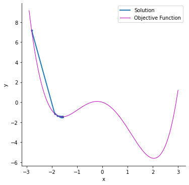
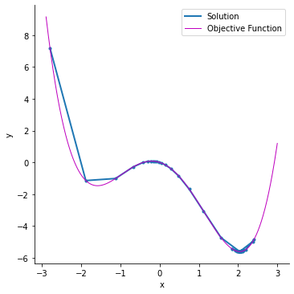

# Ускоренные градиентные методы

## Momentum

https://optimization.cbe.cornell.edu/index.php?title=Momentum

У градиентного спуска (в особенности у стохастического варианта) имеется большая проблема. Градиент по шагам может сильно осцилироваться и следовательно может получаться ситуация, когда значение $\omega$ скачет вокруг истинного оптимума, не заходя в него. 
Для решения такой проблемы возможно использовать метод инерции (более известный как Momentum). Он заключается в накоплении градиента по шагам, что позволяет внести саму компоненту 'инерции' в движении к оптимуму.

Для обновления весов на каждом шаге будем использовать накопленное значение градиента по шагам. Формализуем запись:

$$
h_0 = 0 \\
h_k = \alpha h_{k-1} + \nabla_{\omega} \mathcal{L}(X, \omega_{k-1}) \\
\omega_k = \omega_{k-1} - \eta h_k
$$

где:

$\alpha$ - параметр метода, определяющий скорость затухания градиентов с предыдущих шагов

$\eta$ - скорость обучения 

Одним из приятных свойств данного метода можно считать потенциальную возможность работы с невыпуклыми задачами. 
Использование импульса позволяет сглаживать осцилляции траектории оптимизации и может способствовать выходу из неглубоких локальных минимумов или седловых точек, однако не гарантирует нахождение глобального оптимума.

Иллюстрация работы градиентного спуска на невыпуклой функции [Статья](https://optimization.cbe.cornell.edu/index.php?title=Momentum)

Иллюстрация работы градиентного спуска с инерцией на невыпуклой функции [Статья](https://optimization.cbe.cornell.edu/index.php?title=Momentum)

## Nesterov Momentum

Улучшением классического импульса является метод, предложенный Юрием Нестеровым. Он заключается в том, что градиент будет также накапливаться, однако для каждого нового шага градиент будет пересчитываться не в данной точке, а в точке, в которой значение теоретически оказалось бы, если бы следовало направлению импульса. 

Для выпуклых гладких функций метод Нестерова обладает оптимальной по порядку скоростью сходимости $O (\frac{1}{k^2})$ среди методов первого порядка.

Запишем шаги данного алгоритма:

$$
h_0 = 0 \\
h_k = \alpha h_{k-1} + \nabla_{\omega} \mathcal{L}(X, \omega_{k-1} - \alpha h_{k-1}) \\
\omega_k = \omega_{k-1} - \eta h_k
$$