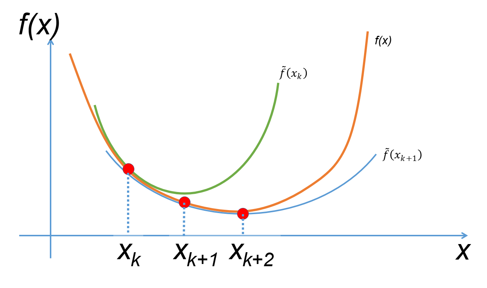

# Методы второго порядка

## Метод Ньютона

Рассмотрим приближение функции потерь $f(x)$ в точке $x_k$ через ряд Тейлора со вторым членом:

$$
f(x) \approx f(x_k) + \langle \nabla f(x_k), (x - x_k) \rangle + \langle \frac{1}{2} \nabla^2 f(x_k) (x - x_k), (x - x_k) \rangle = m_k(x)
$$

Аналогично методам первого порядка, хотим чтобы каждый последующий шаг минимизировал функцию:

$$
x_{k+1} := \argmin_{x \in \R^n} m_k(x)
$$

В силу своей квадратичности данная задача выпукла и имеет минимум (можно не накладывать условие на положительную определенность Гессиана).

Для решения данной задачи найдем градиент $m_k(x)$ по $x$ и приравняем к нулю:

$$
\nabla m_k(x) = \nabla f(x_k) + \nabla^2 f(x_k) (x - x_k)
$$

Подставми условие минимума $\nabla m_k(x_{k+1}) = 0$ и найдем $x_{k+1}$:

$$
m_k(x_{k+1}) = 0 \\
\nabla f(x_k) + \nabla^2 f(x_k) (x_{k+1} - x_k) = 0 \\
\nabla^2 f(x_k) (x_{k+1} - x_k) = - \nabla f(x_k)
$$

В случае обратимости Гессиана имеем следующее:

$$
(x_{k+1} - x_k) = - [\nabla^2 f(x_k)]^{-1} \nabla f(x_k) \\
x_{k+1} = x_k - [\nabla^2 f(x_k)]^{-1} \nabla f(x_k)
$$

# Квазиньютонные методы

Метод Ньютона собственно имеет следующий вид:
$$
x_{k+1} = x_k - \alpha_k s_k
$$

Где 
$$
s_k = -B_k \nabla f(x_k), \space B_k = [\nabla^2 f(x_k)]^{-1}
$$ 

Можно заметить, что если взять за $B_k$ еденичную матрицу $I_n$, получится в точности градиентный спуск.

Главный смысл Квазиньютонных методов - приближение Гессиана (или сразу обратного Гессиана $B_k$), причем $H_k$ стремится к значению обратного Гессиана в точке оптимума, если формально:

$$
H_k \rarr_{k \rarr \inf} \nabla^2 f(x^*) \\
B_k \rarr_{k \rarr \inf} [\nabla^2 f(x^*)]^{-1}
$$

Рассматривается следующая схема обновления:

$$
H_{k+1} = H_k + \Delta H_k \\
B_{k+1} = B_k + \Delta B_k
$$

Если рассмотреть аппроксимацию Тейлора от градиента в точке $x_{k+1}$:

$$
\nabla f(x) \approx \nabla f(x_{k+1}) + \nabla^2 f(x_{k+1}) (x - x_{k+1}) \\
\nabla f(x) - \nabla f(x_{k+1}) \approx \nabla^2 f(x_{k+1}) (x - x_{k+1}) \\
Подставим \space{} x=x_k \\
\nabla f(x_k) - \nabla f(x_{k+1}) \approx \nabla^2 f(x_{k+1}) (x_k - x_{k+1})
$$

Если взять $\Delta x = x_{k+1} - x_k$, то 

$$
\Delta y_k = \nabla f(x_{k+1}) - \nabla f(x_k) \\
\Delta x_k = B_{k+1} \Delta y_k
$$

Откуда можно записать обновление $\Delta B_k$

$$
\Delta x_k = B_{k+1} \Delta y_k \\
\Delta x_k = B_k \Delta y_k + \Delta B_k \Delta y_k \\
\Delta B_k \Delta y_k = \Delta x_k - B_k \Delta y_k
$$

## Метод Бройдена

## DFP (Davidon–Fletcher–Powell) метод

https://en.wikipedia.org/wiki/Davidon–Fletcher–Powell_formula

$$
s_k = x_{k+1} - x_k \\
s_k = x - x_k
$$

Вместо подсчета и хранения Гессиана можно на каждом шаге искать аппроксимацию Гессиана через уравнение секущей. Можно искать либо прямой Гессиан, либо сразу обратный Гессиан

Прямой:
$$
B_{k+1} = B_k - \frac{B_k s_k s_k^T B_k}{s_k^B B_k s_k} + \frac{y_k y_k^T}{y_k^T s_k}
$$

Обратный:
$$
H_{k+1} = H_k - \frac{ H_k y_k y_k^T H_k }{ y_k^T H_k y_k } + \frac{ s_k s_k^T }{ y_k^T s_k }
$$

## BFGS (Broyden–Fletcher–Goldfarb–Shanno)